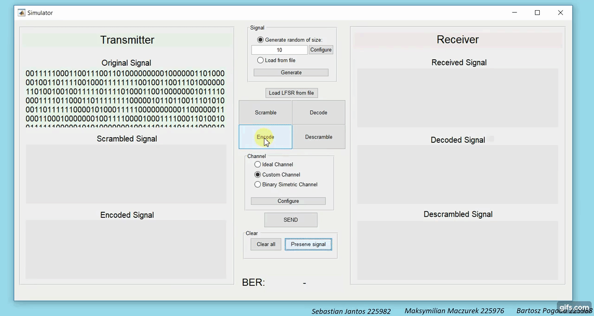

# Scrambling
Team project for studies. Basically a transmission simulator written in matlab that allowed us later on to perform some analysis on:
  * Ethernet 64b/66b
  * Scrambling
  
  Mostly on how they affect BER (Bit Error Rate) in deysnchronization-modelling channel
  
## Documentation
There is documentation describing the simulator and analysis results. Unluckily (for some of you) it is written entirely in Polish. [Link](https://github.com/grupa-projektowa-scrambling/scrambling/blob/master/docs/PL_doc.pdf)

## Short demo (click)
[

](https://www.youtube.com/watch?v=5jN0V85bvbk) 

## Team members
 * Sebastian Jantos (Leader)
 * Maksymilian Maczurek
 * Bartosz Pogoda
